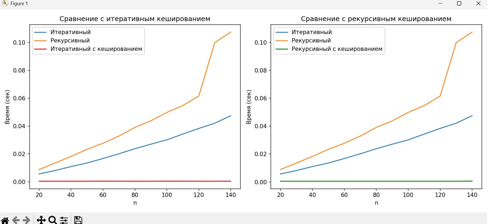

# Лабораторная работа P3122 Тихонова Роза 501455
## Описание лабораторной работы
Цель лабораторной работы - выяснить различие скоростей работы разных подходов по вычислению факториала числа: рекурсивного и итеративного. Для наглядности результат работы скоростей выполнения функций выводится в виде графиков с помощтю библиотеки matplotlib.

## Описание файлов и работы функций: 
**main.py**
### Импорт библиотек: 
```
import timeit
import matplotlib.pyplot as plt
import random
from functools import lru_cache
```
timeit - засекает время выполнения функции создания факториала и выбирает наименьшее время выполнения
matplotlib - библиотека для визуализации с помощью графиков
random - встроенный модуль python
functools - библиотека для кеширования, которая сокращает время выполнения функции

### Описание работы функций 


 