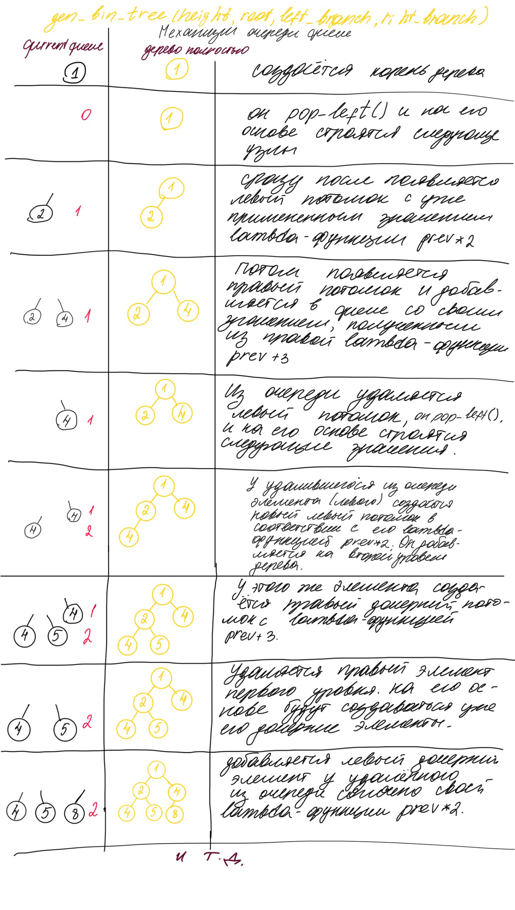

# ЛАБОРАТОРНАЯ РАБОТА №5 Тихонова Роза Р3122. Вариант 1.
В этой лабораторной работе рассматривается механизм функции __gen_bin_tree()__ используя итеративный метод.
Пользователю предоставляется возможность построения бинарного дерева в визуально удобном формате а также в виде структуры словаря. Добавлена валидация входных значений и вылет ошибок на случай недопустимых значений.
- В файле __main.py__ реализована функция создания словаря бинарного дерева. Она принимает на вход значение высоты и корневого значения. Если значения не введены, то по дефолту будет использоваться высота, равная 5, и значение корня дерева, равное 1.
- В файле __develop.py__ реализовано форматирование словаря в user-friendly формат с помощью встроенных методов python. Также возможно взаимодействие с программой через терминал, реализован ввод входных значений.
- В файл __tests.py__ добавлены тесты, проверяющие корректность работы программы с помощью библиотеки *unittest*. Добавлены как ложные так и истинные тесты. 
## Описание функций:
### main.py
__def gen_bin_tree(height, root)__ - генерирует бинарное дерево заданной высоты с использованием итеративного алгоритма на основе очереди deque из модуля collections, используя обход в ширину.
1. 'value': числовое значение узла
2. 'left': левое поддерево (словарь или None)
3. 'right': правое поддерево (словарь или None)

*Правила генерации значений*
Корневой узел имеет значение, переданное в параметре root
1. Левый потомок вычисляется как root * 2
2. Правый потомок вычисляется как root + 3

*Механизм работы функции*  

С помощью deque мы получаем возможность сохранять текущие элементы в очереди. С каждой итерацией цикла while мы используем метод __popleft()__ у очереди, "забирая" значение узла, от которого будут строиться его дочерние элеметы, согласно их лямбда-функциям.
Нагляднее механизм функции можно изучить на фото ниже:

 

### develop.py
__print_tree_advanced()__ - функция предназначена для читаемого вывода бинарного дерева в консоль в виде горизонтальной древовидной структуры. Принимает на вход словарь, импортированный из файла __main.py__ и форматирует с помощью символов в читабельный формат.

### tests.py
- __test_otrits_high__ - тест с отрицательной высотой. Назначение: проверить обработку некорректного ввода входных данных (дерево не может иметь отрицательную высоту).
- __test_zero__ - тест с нулевой высотой. Назначение: проверить, выполняется ли условие в теле теста при высоте 0.
- __test_floating_point_height__ - тест с дробной высотой. Назначение: проверка того, что значение высоты не дробное (проверка типизации int).
- __test_one__ - тест с высотой 1. Назначение: проверить построение дерева с одним уровнем потомков на соответствие с ожидаемым результатом (структуры словаря).

## Запуск:
```py develop.py``` - для режима разработки и исследования  

```py tests.py``` - для запуска тестов
