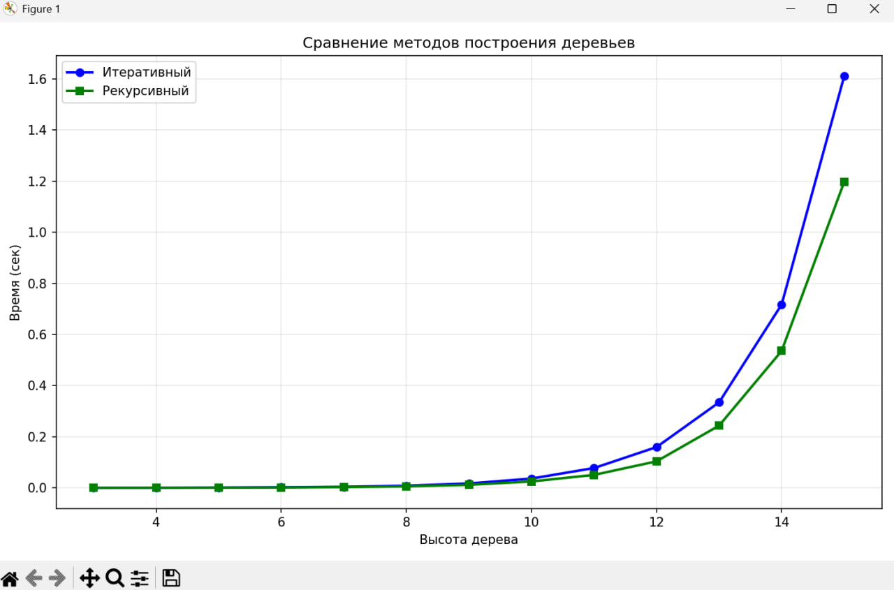

# Лабораторная работа №6 Роза Тихонова Р3122
## Сравнение производительности рекурсивного и итеративного подхода построения бинарного дерева.  

## Описание лабораторной работы
Цель лабораторной работы - выяснить различие скоростей работы разных подходов по построению бинарного дерева: рекурсивного и итеративного. Для наглядности результат работы скоростей выполнения функций выводится в виде графиков с помощью библиотеки matplotlib.

## Описание файлов и работы функций
__main.py__
### Импорт библиотек: 

```
import timeit
import matplotlib.pyplot as plt
import random
from collections import deque
from typing import Dict, Any, Callable, Union
```
- *timeit* - засекает время выполнения функций построения деревьев и выбирает наименьшее время выполнения

- *matplotlib* - библиотека для визуализации с помощью графиков

- *random* - встроенный модуль Python для генерации случайных чисел

- *collections.deque* - очередь для добавления и удаления элементов в итеративном подходе

- *typing* - модуль для типизации

### Описание работы функций:
__def build_tree_recursive()__ - функция, реализующая механизм построения бинарного дерева с использованием рекурсивного подхода.

- Внутри себя использует рекурсию с базовым случаем, когда высота равна 0

- Для каждого узла создает левого потомка с значением value * 2 и правого потомка с значением value + 3

- Возвращает словарь, представляющий структуру дерева

__def build_tree_iterative()__ - функция, реализующая механизм построения бинарного дерева с использованием итеративного подхода.
- Использует очередь (deque) для обхода в ширину.

- Создает узлы последовательно, добавляя их в очередь для обработки

- Использует lambda-функции для вычисления значений потомков (по дефолту: левый - x*2, правый - x+3)

- Возвращает словарь, представляющий структуру дерева  

__def benchmark()__ - бенчмарк-функция. Возвращает среднее минимальное значение выполнения.
- func - тестируемая функция построения дерева

- data - входные данные (высоты деревьев для тестирования)

- number=100 - количество выполнений за одно измерение

- repeat=3 - количество повторений измерений

 main-функция - внешняя функция-обёртка.

__def main()__ - вычисление, замер времени и вывод графика для сравнения производительностей.
    
- Запускает обе функции  

- Измеряет время выполнения  

- Строит графики и выводит результаты

## Запуск
Программу можно запустить локально с помощью команды:
```
py main.py
```
На выводе вы увидите визуальное представление того, с какой скоростью выполнились функции (см. ниже)

## Вывод
После запуска ввыведется график, который показывает различие скоростей работы функций: 

 

Вывод такой, что рекурсивный подход, согласно графику, является более производительным, чем  итеративный, т.к. итеративный метод постоянно создает кортежи и управляет очередью, что добавляет дополнительное время.

